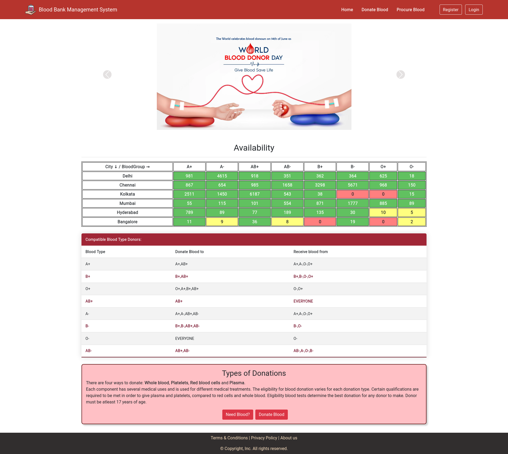

# Blood Bank Management System

To run on your local machine go to src/main/java/.../Application.java file and right click and run

We have recently deployed out project on Herokuapp. 
Please feel free to visit the website. We would love to hear your feedback.
Link : https://blood-bank-tmsl.herokuapp.com/

Project Title : Blood Bank Management System

This website is a Blood Bank Management System where users can book slots to Donate blood. They can choose center fr donation. User can also submit a procure request for a specific blood type on their desired date. The request will be granted based on the availability. For both Donation and Procurement success pages/ receipts will be generated by the System which can be printed by the user. The success pages will nearest Centers to the user for Donation and procurement of Blood.

# Screnshots

